# Django_CRUD 복습

> ​	그동안 배운 Django의 CRUD를 복습해서, 저번 Django 관통형 프로젝트인 영화리뷰 게시판을 만드는 작업을 하겠다.

### 1. 기본 세팅 작업

> 사람마다 다를 수 있지만, 처음 프로젝트를 생성하고, 다음과 같은 일련의 작업을 한다. 어느 프로젝트를 하나, 무조건 이 세팅을 하고 난뒤에 간다. 만약에 static 즉 html에서,  css나 image를 링크를 걸거나, bootstrap을 다운 받아서 쓸때에는 static 설정도 해주고 간다, 하지만 그것은 부차적인 요소이므로, 나중에 하겠다. 기본적인 흐름은 settings.py와 urls.py를 먼저 설정해주고 가는 점이다.

#### 	1.1 프로젝트 생성

- 터미널에 `django-admin startproject test_crud` 명령어 치기


#### 	1.2. 앱 생성

- 터미널에 `python manage.py startapp articles`  명령어 치기


#### 	1.3. test_crud/settings.py에 앱등록 및 Allowed_host 변경 과 templates DIR 설정

- ```python
  ALLOWED_HOSTS = ['*']
  
  
  # Application definition
  
  INSTALLED_APPS = [
      'django.contrib.admin',
      'django.contrib.auth',
      'django.contrib.contenttypes',
      'django.contrib.sessions',
      'django.contrib.messages',
      'django.contrib.staticfiles',
      'articles'
  ]
  
  
  TEMPLATES = [
      {
          'BACKEND': 'django.template.backends.django.DjangoTemplates',
          'DIRS': [
              os.path.join(BASE_DIR,'templates')
              ],
          'APP_DIRS': True,
          'OPTIONS': {
              'context_processors': [
                  'django.template.context_processors.debug',
                  'django.template.context_processors.request',
                  'django.contrib.auth.context_processors.auth',
                  'django.contrib.messages.context_processors.messages',
              ],
          },
      },
  ]
  
  
  LANGUAGE_CODE = 'ko-kr'
  
  TIME_ZONE = 'Asia/Seoul'
  
  ```


#### 	1.4. test_crud/urls.py에 include 설정을 해주기

- ```python
  from django.contrib import admin
  from django.urls import path,include
  
  urlpatterns = [
      path('admin/', admin.site.urls),
      path('articles/',include('articles.urls'))
  ]
  
  ```


#### 	1.5. artilces에 urls.py 생성 및 URL namespace 지정

- ```python
  from django.urls import path
  
  
  app_name='articles'
  
  urlpatterns=[
  
      ]
  ```

- 보통 `app_name`은 실제 `app`의 이름과 동일시하는게 기본적이다.


### 2. Models.py 정의 및 Forms.py 설정, admin.py 설정

> 위의 1번의 기본적인 세팅작업이 끝나면, 다음으로 하는 작업은 models.py에서 현재 앱에서 쓸 model을 정의해주고, forms.py에 설정을 해주는 작업을 먼저해준다.  그냥 화면만 보여주는 것이 아닌, 여기서 게시판을 생성하고, 입력값을 검정할때에는,  가장 큰 틀이, models.py라 생각되어 먼저 설정해준다.


#### 	2.1. articles/models.py 에 클래스 정의 및 해당 앱에서 쓸 여러값들 설정해주기

- ```python
  from django.db import models
  
  # Create your models here.
  
  class Review(models.Model):
      title=models.CharField(max_length=100)
      movie=models.CharField(max_length=50)
      genre=models.CharField(max_length=100)
      content=models.TextField()
      rank=models.IntegerField(default=0)
      summery=models.CharField(max_length=100)
      created_at=models.DateTimeField(auto_now_add=True)
      updated_at=models.DateTimeField(auto_now=True)
  ```

- 클래스를 만들어주기 위해서, 먼저 `models.Model`에서 클래스를 상속받아야한다. 그리고 난 뒤, 성격에 맞게 `Field`를 정의해주면 된다.

- `title`,`movie` ,`genre`은 길지 않은 글자들이 들어갈 것이라, `CharField`를 넣었다. 그리고 메인이 되는 `content`은 긴 글이 될거라, `TextField`를 썼다. 여기서 주의할 점은 `CharField`은 무조건 `max_length`을 설정해주어야 한다.

- `rank`은 숫자값이 들어갈거라 `IntegerField`을 설정해줬고, `default`로 0을 설정해줬다.

- `created_at` ,`updated_at`은 글의 생성시간과 수정시간을 알려주는 것인데, 이것은 뒤의 설정인 `auto_now_add`인지, `auto_now`인지에 따라서 차이가 난다.

- 이렇게 해당 앱에서 쓸 클래스를 정의해주고 난뒤에 잊지말고 해야할 것은 , db에 적용시켜주는 것이다.

  - `python manage.py makemigrations` 명령어를 친다.
  - `python manage.py migrate`명령어를 친다.
  - 만약 클래스를 변경할 일이 있으면, `articles/migrations/`폴더에 있는 파일들과, `db.sqlite3`를 삭제해주고, 다시 위의 두 명령어를 치는게 깔끔하다.


#### 2.2. forms.py를 생성해주고, 입력 폼을 만들어주기.

- `forms.py`라는 파일이 처음에 없으므로,  해당 앱에 `forms.py`를 생성해준다.

- 입력 폼을 만드는 방법에는 여러가지가 있고, 수업중에 배운 방식은 두가지가 있다. 

  - `forms.Form`을 상속받아, 하나하나 전부 설정해주는 방식

    - 이 방식은 수업중에 처음에만 보여주고 잘 안보여줬으므로 이런 방식이 있다는 정도로 알면 될것 같다.

    - ```python
      from django import forms
      
      
      class ReviewForm(forms.Form):
          title=forms.CharField()
          content=forms.CharField(widget=forms.Textarea)
          ### 위와 같이 하나하나 전부 설정을 해줘야한다.
      ```

      

  - `forms.ModelForm`을 상속받아, 우리가 만든 클래스를 통해 자동적으로 만드는 방식


- 우리가 수업중에 자주쓰는 2번째 방식으로 입력 폼을 만들어 보겠다.

  ```python
  from django import forms
  from .models import Review
  
  class ReviewForm(forms.ModelForm):
      
      class Meta:
          model=Review
          fields='__all__'
  ```

- 위와 같이 하면, `django`에 있는 모듈을 통해, 우리가 만든 클래스의 설정에 맞게 자동적으로 입력폼이 만들어진다.

- 여기서 입력폼을 수정하는 방법이 있는데 그것은, 후반부에 설명하도록 하겠다.


#### 2.3. admins.py에 model을 등록해주고 관리자계정 생성하기

- 이 작업은 필수적은 아니다. 하지만 개발 과정에서 입력값을 수정하고, 삭제하는데 편리하므로 하는것을 권장한다.

- ```python
  from django.contrib import admin
  from .models import Review
  # Register your models here.
  
  
  admin.site.register(Review)
  ```

- 이렇게 해준뒤 관리자페이지에 들어갈수 있는 관리자계정을 설정해준다.

  - 터미널에 `python manage.py createsuperuser`를 치고, 관리자 계정을 생성해준다.

- 위와 같은 일련의 작업이 끝나면 터미널에서 해야할 작업들은 거의 끝났으므로, 서버를 실행해준다.

  - 터미널에 `python manage.py runserver 8080`을 친다.

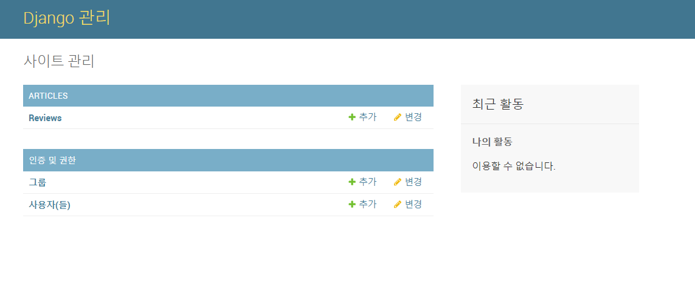

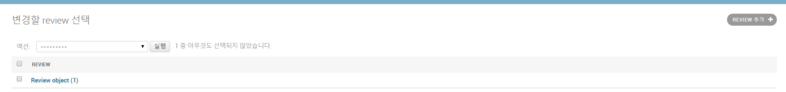

- 위와같이 설정을 하면 다음과 같이 기본적인 화면이 나온다. 기본적인 사항이다. 그런데 여기서는 내부에 있는 Review에 대해서 잘 보이지 않으므로, 보이는 Display를 바꾸고 싶으면 다음과 같이 하면 된다. 이것은 수업시간에 얼핏 지나가면서 설명해 준 것이므로, 선택사항이다.

  ```python
  from django.contrib import admin
  from .models import Review
  # Register your models here.
  class ReviewAdmin(admin.ModelAdmin):
      list_display=('title','content','created_at','updated_at')
  
  admin.site.register(Review,ReviewAdmin)
  ```

  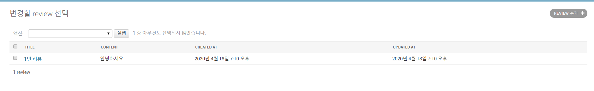
  
- 위와 같이 admin.py를 추가로 설정해주면 다음과 같이 보기 편하게 나와준다.  이것은 선택사항이므로, 하고싶은 사람만 하면 된다.


### 3. CRUD의 CR 작업

> 먼저 models와 form을 설정하는 이유가 큰 뼈대를 만드는 작업인 이유가 가장 크지만, 먼저 한 이유 중 하나는 위와 같이 설정을 한뒤에는 터미널에 보통 추가적인 명령어를 치는 경우가 별로 없다. 그래서 위와 같은 작업을 한뒤에는 서버를 계속 실행시킬려고 하는 이유도 있다. 
>
> 다음으로 할 작업은 CRUD에서 가장 기본적인 CR을 동시에 할것이다. 
>
> 먼저 CR에서 Create를 먼저 할것이며, R은 총 2가지로 전체적인 목록을 보여주는 index 페이지와 세부항목을 보여주는 Detail 페이지를 설정해줄것이다. 

#### 3.1. Create 만들기. 

- <h4>articles/urls.py

  ```python
  from django.urls import path
  from . import views
  
  app_name='articles'
  
  urlpatterns=[
      path('',views.index,name='index'),
      path('create/',views.create,name='create'),
      ]
  ```

- 보통 url의 경로와 함수 명과 Url 네임은 보통 일치시키는게 보통이다.


- <h4>articles/views.py</h4>

  ```python
  from django.shortcuts import render,redirect
  from .forms import ReviewForm
  # Create your views here.
  
  def index(request):
      return render(request,'articles/index.html')
  
  def create(request):
      if request.method=='POST':
          form=ReviewForm(request.POST)
          if form.is_valid():
              form.save()
              return redirect('articles:index')
      else:
          form=ReviewForm()
      context={
          'form':form,
      }
      return render(request,'articles/create.html',context)
  ```

- 먼저 create를 만들고 index를 만들꺼라, index에는 그냥 처음에는 html 페이지를 보여주는걸 먼저 해줬다.

- create는 한 url를 가지고 GET,POST방식으로 구분을 해줘서 기능을 나눌 것이기 때문에 if문으로 해당 Url에 들어오는 방식이 GET 요청방식인지, POST 요청방식인지 구분을 해줬다.

- 사용자가 처음에 해당 URL을 들어오면, GET요청으로 들어올 것이다. 그러므로 사용자에게 입력할 수 있는 빈 form을 만들어주고, 그것을 context에 넣어 반환해주었다.

- 그리고 사용자가 POST요청으로 해당 URL을 들어왔다는것은, 우리가 제공한 빈 form에 사용자가 값을 입력하고 넣어준것이다. 그러므로 우리는 사용자가 입력한 값을 `ReviewForm(request.POST)`라는 방식으로 넣어주고, 이것이 값이 유효한지 확인해준다. 그리고 난뒤 save를 해준다. 

- 여기서는 아직 detail 페이지를 만들어주지 않았으므로, 전체목록 페이지로 가도록 `redirect` 해줬다.

- 나중에는 create와 update를 합쳐줄것이지만, 현재는 분리해주었다.


- <h4>articles/templates/articles/create.html</h4>

  ```html
  <h1>새 글 쓰기</h1>
  <form action="" method='POST'>
      
      {{ form.as_p }}
      <button>제출</button>
  </form>
  ```

- 우리는 GET,POST 방식으로 나누어서 할것이므로, form의 method를 POST를 해주고, POST를 해주면, 당연하게, `csrf_token`을 추가해준다.

- `{{ form.as_p }}`는 form을 p태그로 감싸서 나오게 해주는 설정이다.


- 결과 화면 

  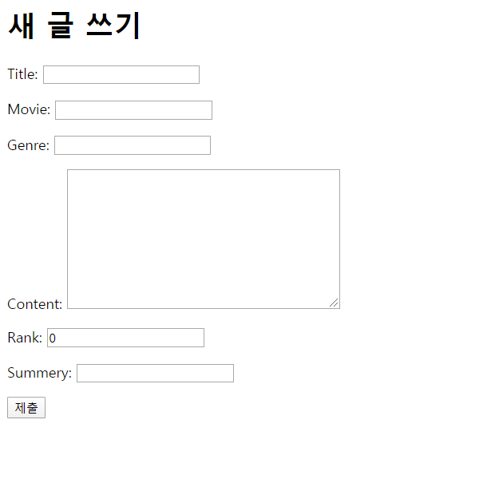

- 위와 같이 입력폼이 생성된다. 입력폼에 대한 추가적으로 꾸미는 것은 차후로 하도록 하고 먼저 기능적인 요소들만 만들도록 하겠다.


#### 3.2. Read 만들기.

> ​	read에는 크게 두가지가 있다. 전체목록을 보여주는 Index 페이지와 해당 게시글의 detail한 것을 보여주는 Detail 가 있다. 여기서는 먼저 Index 페이지를 만들고 Detail 페이지는 나중에 만들도록 하겠다.

##### 3.2.1 Index 페이지 만들기

- <h4>articles/views.py</h4>

  ```python
  from .models import Review
  
  def index(request):
      reviews=Review.objects.all()
      context={
          'reviews':reviews
      }
      return render(request,'articles/index.html',context)
  ```

- <h4>artilces/templates/articles/index.html</h4>

```html
<h1>목록 페이지 입니다.</h1>

<a href="">새 글 쓰기</a>

    <p>{{ review.id }}번 글 </p>
    <hr>
    <p>제목 : {{review.title}}</p>
    <p>영화 : {{review.movie}}</p>
    <p>별점 : {{review.rank }}</p>


    <hr>


```


- 결과화면

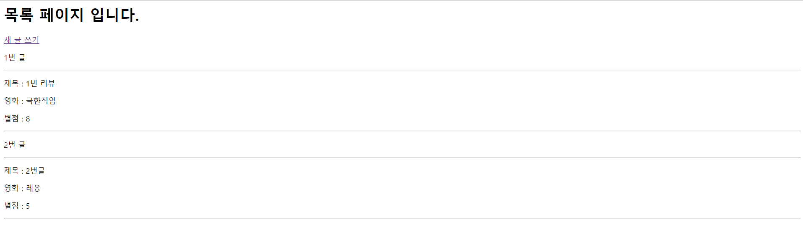


##### 3.2.2 Detail 페이지 만들기

- <h4>articles/urls.py

  ```python
      path('<int:id>',views.detail,name='detail'),
  ```

- <h4>articles/views.py

  ```python
  from django.shortcuts import get_object_or_404
  
  def detail(request,id):
      review=get_object_or_404(Review,id=id)
      context={
          'review':review,
      }
      return render(request,'articles/detail.html',context)
  ```

- 사용자가 없는 페이지를 접근했을때 기존의 `Reviews.objects.get(id=id)`를 하게 되면, 500번대 에러가 나오게 된다. 하지만 이것은 개발자 잘못이 아니라, 없는 페이지를 접속한 사용자 잘못이므로, `get_object_or_404`모듈을 사용해준다.


- <h4>articles/templates/articles/detail.html

  ```html
  <h1>{{ review.id }} 번글</h1>
  
  <h3>제목 : {{review.title}}</h3>
  <h3>영화제목 : {{review.movie }}</h3>
  
  <div>{{review.content }}</div>
  
  
  <hr>
  <p>별점 : {{review.rank}}</p>
  <hr>
  <p>요약 : {{review.summery}}</p>
  <hr>
  <p>작성시간 : {{review.created_at}}</p>
  <p>최종 수정 시간 : {{review.updated_at }}</p>
  ```


- 결과 화면

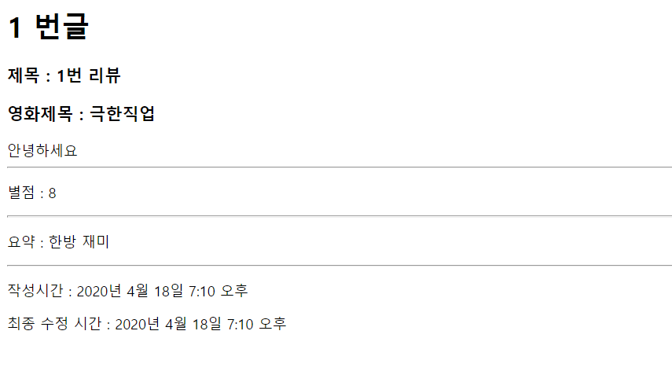

- 위에서 `create`에서 새글 작성 후 전체목록 페이지로 가던것을 detail 페이지로 가도록 바꾸어주었다.

  - 수정 전

    ```python
                form.save()
                return redirect('articles:index')
    ```

  - 수정 후

    ```python
                review=form.save()
                return redirect('articles:detail',review.id)
    ```

    


### 4. CRUD의 UD 작업

>  앞서한 CR을 할 줄 알면, UD 작업은 매우 간단하다. 먼저 Update에서는 수정이라는것을 기억해주고, 수정할때에는 사용자가 작성했던 내용을 넣어주는 것과, 수정을 하고 저장할때 새로 생성되지않고 수정이 되도록 설정해줘야한다.
>
> Delete 작업은 사용자가 실수로 url을 들어왔을때, 삭제가 되면 안된다. 그래서 사용자가 삭제 버튼을 눌렀을때에만, 작동이 되도록 작업해야한다.


#### 4.1 Update 만들기

- <h4>articles/urls.py

  ```python
      path('<int:id>/update/',views.update,name='update'),
  ```

- <h4>articles/views.py</h4>

  ```python
  def update(request,id):
      review=get_object_or_404(Review,id=id)
      if request.method=='POST':
          form=ReviewForm(reqeust.POST,instance=review)   ###  이 부분이 중요
          if form.is_valid():
              review=form.save()
              return redirect('articles:detail',review.id)
  
      else:
          form=ReviewForm(instance=review)
      context={
          'form':form
      }
  
      return render(request,'articles/form.html',context)
  ```

- 여기서 중요 한점은 `instance=review`이다. 이것은 수정을 하는 사용자의 데이터를 넣어주는 역할을 한다. 이것은 사용자가 수정한 후에도 중요하게 작동하는데, 이 부분을 빼고, 저장할 시, 장고는 그냥 새로운 데이터를 저장하는걸로 인식해서 새id를 발급되게 된다. 그러므로 `instance=review`를 넣어줌으로서, 어느 id를 수정하는지를 알려줘야한다.

- <h4>articles/templates/articles/form.html</h4>

  ```html
  <h1>수정하기</h1>
  <form action="" method='POST'>
      
      {{ form.as_p }}
      <button>제출</button>
  </form>
  ```

- <h4>결과 화면

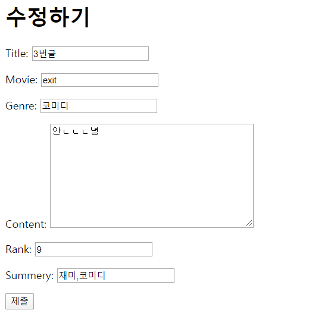


- 결과적으로 create와 update는 정보를 넣어주냐의 차이만 있을 뿐 나머지 프로세스는 동일하기 때문에 `form.html`로 합쳐주는 작업을 하겠다.

  ```html
  
  
      <h1>새 글 작성</h1>
  
      <h1>수정하기</h1>
  
  <form action="" method='POST'>
      
      {{ form.as_p }}
      <button>제출</button>
  </form>
  ```

- 여기서 달라진 점은 위에 `BTL`을 이용해서 구분해준것이다. `resolver_match.url_name` 메서드를 이용해 현재 접속한 사이트의 `url_name`을 반환해준다. 그걸로 여기가 새 글작성인지, 수정하기인지 구분해준다.


#### 4.2 Delete 만들기

- <h4>articles/urls.py</h4>

  ```python
      path('<int:id>/delete/',views.delete,name='delete')
  ```

- articles/views.py

  ```python
  from django.views.decorators.http import require_POST
  
  @require_POST
  def delete(request,id):
      review=get_object_or_404(Review,id=id)
      review.delete()
      return redirect('articles:index')
  ```


- <h4>articles/templates/articles/detail.html에 delete 버튼추가

  ```html
  <form action="" method=POST>
      
      <button>삭제</button>
  </form>
  ```

- 결국에 POST 요청이기 때문에 csrf_token을 추가해줘야하고, form형식으로 만들어줘야한다.


- 결과화면

  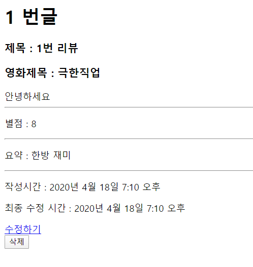


### 5. 주의할점

- `CRUD`는 상대적으로 어렵지 않은 작업이라, 헷갈리부분이 적긴 하지만, 위에서 말하기도 했지만 만들시 주의할점들은 몇몇개를 써보도록 하겠다.

- `POST`요청을 할 때는 잊지말고 `csrf_token`을 써주는 것을 까먹지 말자.

- `app_name`이나 `url_name`은 app과 url과 동일하게 해주는것이 만들어줄때 편하다.

- `URL namespace`를 사용할때 순서에 주의하자, `html`에서 쓰든 `views.py`에서 `redirect`를 쓰던간에 순서는 동일하다.

  ``

  `redirect('app_name:url_name',variable_routing)`

  - 보시다 시피 순서는 동일하다, 그게 html에 쓰는가와 python에 쓸때의 문법적인 차이만 있을 뿐 동일하다.

- Update를 할때에는 instance를 까먹지 말자, instance를 빼먹으면 새로운 글로 저장이 된다.

- Delete를 할때에는 POST 방식인지 확인하는 모듈을 추가해주자. 그렇지 않으면 사용자가 url로 접근해버리면, 지워져버릴수 있다.

- Create와 Update를 합칠때 `resolver_match.url_name`으로 구분해주는 걸 주의해주자.

- 인제 밑으로는 기능적인 요소 말고 꾸밈요소들에 대한 설명을 하겠다.

  - base.html 적용방법
  - bootstrap 적용 방법 3가지
    - cdn을 이용한 bootstrap
    - static을 이용한 bootstrap
    - django-bootstrap을 이용한 bootstrap
  - forms를 수정하는 방법


### 6. Appendix

#### 6.1 base.html 적용방법

> 공통적으로 쓰는 것을 한 문서에 만들어서 적용시킬 수 있다. 우리는 보통 이러한 기능을 하는 html 문서를 `base.html`이라고 명명하고 활용하도록 하겠다.

- <h4>test_crud/settings.py

```python

TEMPLATES = [
    {
        'BACKEND': 'django.template.backends.django.DjangoTemplates',
        'DIRS': [
            os.path.join(BASE_DIR,'templates')
            ],
        'APP_DIRS': True,
        'OPTIONS': {
            'context_processors': [
                'django.template.context_processors.debug',
                'django.template.context_processors.request',
                'django.contrib.auth.context_processors.auth',
                'django.contrib.messages.context_processors.messages',
            ],
        },
    },
]

```

- 여기서 중요한 부분은 `'DIRS'`부분이다. 여기서 정확한 경로를 적어줘야한다. 여기서 `BASE_DIR`은 같은 settings.py에 적혀져있다.  찾아보면 `BASE_DIR = os.path.dirname(os.path.dirname(os.path.abspath(__file__)))` 라고 적혀져잇는데, 이 말을 해석해보면 해당 프로젝트가 생성되어있는 최상위폴더를 찾아주는 것임을 알 수 있다. 

- 그리고 그 뒤에 `template`는 우리가 `template`폴더를 만들고 거기에 저장할것이기때문에, 만들어놓았다. 다른 폴더이름을 해도 되지만, 장고 개발자에서는 html파일은 template폴더에 저장하는 것이 하나의 규칙이 되었다.

  

  

- <h4>templates/base.html

  ```html
  <!DOCTYPE html>
  <html lang="ko">
  <head>
      <meta charset="UTF-8">
      <meta name="viewport" content="width=device-width, initial-scale=1.0">
      <meta http-equiv="X-UA-Compatible" content="ie=edge">
      <title>Document</title>
  </head>
  <body>
      
      
      
  </body>
  </html>
  ```

- 위와 같이 만들어주고, 자기가 넣어주고 싶은 위치에   을 만들어준다.

- 사용법은 쓰고자 싶은 html의 최상단에 을 써주고, 해당 html의 내용을 , 으로 감싸준다

- ex) articles/templates/articles/index.html

```html



<h1>목록 페이지 입니다.</h1>

<a href="">새 글 쓰기</a>

    <p>{{ review.id }}번 글 </p>
    <hr>
    <p>제목 : {{review.title}}</p>
    <p>영화 : {{review.movie}}</p>
    <p>별점 : {{review.rank }}</p>

    <a href="">글 보러가기</a>

    <hr>




```


#### 6.2 부트스트랩 적용방법 

##### 6.2.1 CDN을 이용한 적용 방법 

> 가장 쉬운 방법이자, 우리가 자주 쓰던 방법 그저 base.html에 위 아래로 bootstarp cdn을 넣어주면 된다.

- templates/base.html

  ```html
  <!DOCTYPE html>
  <html lang="ko">
  <head>
      <meta charset="UTF-8">
      <meta name="viewport" content="width=device-width, initial-scale=1.0">
      <meta http-equiv="X-UA-Compatible" content="ie=edge">
      <title>Document</title>
      <link rel="stylesheet" href="https://stackpath.bootstrapcdn.com/bootstrap/4.4.1/css/bootstrap.min.css" integrity="sha384-Vkoo8x4CGsO3+Hhxv8T/Q5PaXtkKtu6ug5TOeNV6gBiFeWPGFN9MuhOf23Q9Ifjh" crossorigin="anonymous">
  </head>
  <body>
      
  
      
      <script src="https://code.jquery.com/jquery-3.4.1.slim.min.js" integrity="sha384-J6qa4849blE2+poT4WnyKhv5vZF5SrPo0iEjwBvKU7imGFAV0wwj1yYfoRSJoZ+n" crossorigin="anonymous"></script>
  <script src="https://cdn.jsdelivr.net/npm/popper.js@1.16.0/dist/umd/popper.min.js" integrity="sha384-Q6E9RHvbIyZFJoft+2mJbHaEWldlvI9IOYy5n3zV9zzTtmI3UksdQRVvoxMfooAo" crossorigin="anonymous"></script>
  <script src="https://stackpath.bootstrapcdn.com/bootstrap/4.4.1/js/bootstrap.min.js" integrity="sha384-wfSDF2E50Y2D1uUdj0O3uMBJnjuUD4Ih7YwaYd1iqfktj0Uod8GCExl3Og8ifwB6" crossorigin="anonymous"></script>
  </body>
  </html>
  ```

  

##### 6.2.2 static을 이용한 bootstarp 적용방법

> cdn을 전부 이용하는것이 아닌 css와 js를 다운로드 된 파일을 이용해서 static하게 적용하는 방법이 있다.

- 먼저 https://getbootstrap.com/ 에 접속한뒤 `Download`를 해준다.

  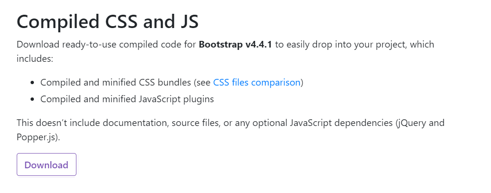

- 압축을 풀면 다음과 같이 css,js 폴더가 있다.

  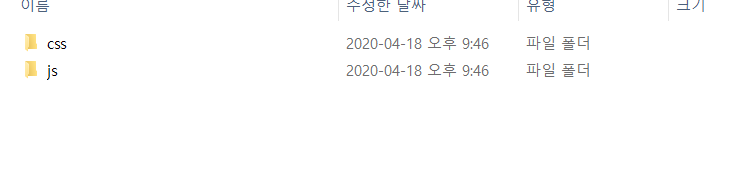

- 열어보면 다음과 같이 기능에 따라 여러가지 파일이 있다.

  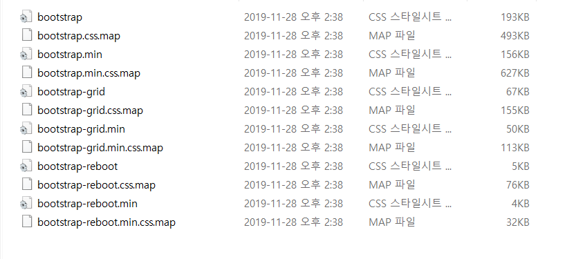

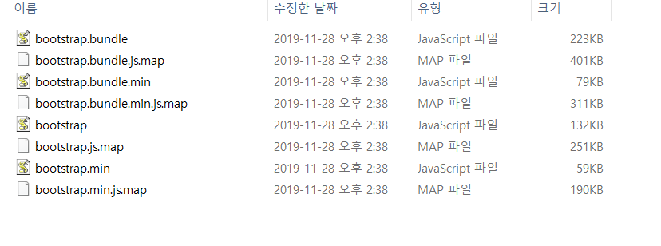

- 여기서 용량을 줄인 `bootstrap.min.js` `bootstrap.min.css` 나 원래 파일인 `bootstrap.js` 와 `bootstrap.css`를 사용한다.

- 위와 같이 파일이 준비 되면 우리는 `static`을 적용하기 위해 `settings.py`에서 설정해줘야할 작업들이 있다.

- <h4>test_crud/settings.py</h4>

  ```python
  STATICFILES_DIRS = (
      os.path.join(BASE_DIR, "static"),
  )
  ```

- 위의 코드를 settings.py 제일 하단에 추가해준다. 이것은 templates와 동일하게 우리가 정적파일을 찾을때 어느위치에서 찾을지 설정해주는것이다. 이렇게 설정해준뒤 static 폴더와 bootstrap폴더를 만들어준다.

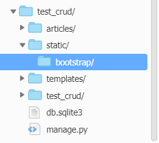

- 다음과 같이 최상단폴더에 static 폴더를 만들어 주고 그 안에 bootstrap 폴더를 생성해준다. 그리고 난뒤에 위에 다운된 파일을 넣어준다.

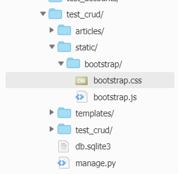


- 다음과 같이 넣어준 뒤,  `base.html`을 다음과 같이 수정해준다.

  ```html
    
  
  <!DOCTYPE html>
  <html lang="ko">
  <head>
      <meta charset="UTF-8">
      <meta name="viewport" content="width=device-width, initial-scale=1.0">
      <meta http-equiv="X-UA-Compatible" content="ie=edge">
      <link rel="stylesheet" href="">
      <title>Document</title>
  
  </head>
  <body>
      <div class="container">
      
  
      
      </div>
  <script src="https://code.jquery.com/jquery-3.4.1.slim.min.js" integrity="sha384-J6qa4849blE2+poT4WnyKhv5vZF5SrPo0iEjwBvKU7imGFAV0wwj1yYfoRSJoZ+n" crossorigin="anonymous"></script>
  <script src="https://cdn.jsdelivr.net/npm/popper.js@1.16.0/dist/umd/popper.min.js" integrity="sha384-Q6E9RHvbIyZFJoft+2mJbHaEWldlvI9IOYy5n3zV9zzTtmI3UksdQRVvoxMfooAo" crossorigin="anonymous"></script>
  <script src=""></script>
  </body>
  </html>
  ```

-  우리가 url_namespace를 쓰는것과 비슷하게 static을 쓰면 된다. 이 방법을 쓸때 가장 주의 해야할 것은  제일 최상단에 을 써줘야한다.


##### 6.2.3 django-bootstrap을 이용한 bootstrap 적용

- https://django-bootstrap4.readthedocs.io/en/latest/ 위 사이트에 접속하여 설치방법을 본다.

  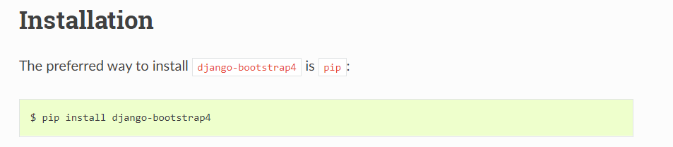

먼저 터미널에 `pip install django-boostarp4`를 쳐서 bootstrap4를 깔아준다. 그리고 난뒤 , settings.py에 

`INSTALLED_APPS`에 `bootstrap4`를 추가해준다.

```html
<!DOCTYPE html>

<html lang="ko">
<head>
    <meta charset="UTF-8">
    <meta name="viewport" content="width=device-width, initial-scale=1.0">
    <meta http-equiv="X-UA-Compatible" content="ie=edge">
    <title>Django Live Sesstion</title>
    
</head>
<body>
    <div class="container">
    
    
    </div>
    
</body>
</html>
```

- 위와 같이 설정해주고, bootstap4를 쓰는 곳에는 를 추가해준다.


#### 6.3 Forms.py 스타일 적용방법

##### 6.3.1 일반적인 방법

- 일반적으로 forms.py에서 클래스 및 여러가지를 설정해준다.

  ```python
  from django import forms
  from .models import Review
  GENRE_SELECT=[
      ('action','액션'),
      ('mello','멜로'),
      ('comedy','코미디')
      ]
  
  SUMMERY_SELECT=[
      ('one','재미한방'),
      ('two','눈물쏙'),
      ('three','통쾌 상쾌'),
      ('four','다시 보고 싶은 영화'),
      ]
  ### 튜플형식으로 하는데, 뒷부분은 사용자에게 보여지는 형식 앞에가 DB에 저장되는 값이다. 그래서 앞은 영어로 해주는게 일반적이다.
  
  
  class ReviewForm(forms.ModelForm):
  
      class Meta:
          model=Review
          fields='__all__'
          widgets={
              
              #### 라디오 버튼을 만들어주는 방법 ####
              'genre':forms.RadioSelect(choices=GENRE_SELECT,
              attrs={
                  'class':'text-primary'
              }
              ),
              
              
              'rank':forms.NumberInput(
                  attrs={'min':'0','max':'10',
                      'class':'text-danger'
                  }
                  ),
              
              
              
              ##### 여러개의 체크박스을 선택해주는 모델 ####
              'summery':forms.CheckboxSelectMultiple(choices=SUMMERY_SELECT)
  
          }
  ```

- `widgets`를 추가해줘서 추가적인 설정을 해준다. 여기서 주의할점은 딕셔녀리 형태이고, 변경하고 싶은 class의 변수명을 불러들어와서 하나하나씩 바꿔준다. 그리고 여기서 `attrs`는 태그 안에 들어간다고 보면 된다. 우리가 css에서 < 이부분 >에 그대로 적어준다고 보면 된다. 그래서 클래스를 적용하고 싶으면 'class'를 쓰고 그 안에 적용하고 싶은걸 적어주면 된다. 

- 


##### 6.3.2 django-bootstrap4를 이용한 수정방법

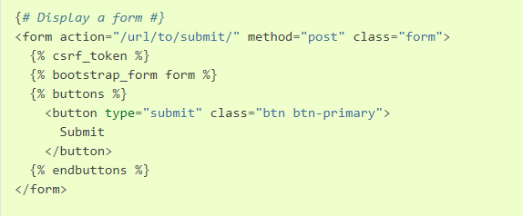

위와 같이 해주면 bootstrap 형식의 form을 쓸수 있다.