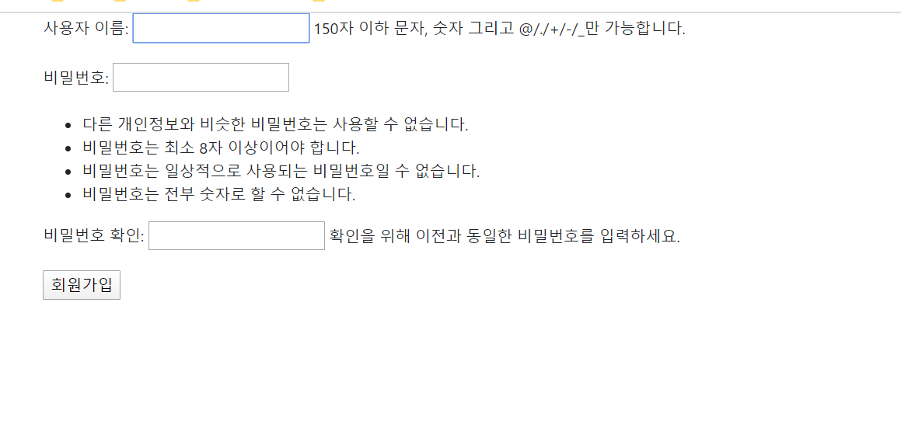
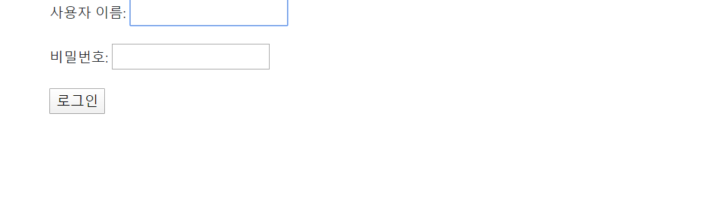
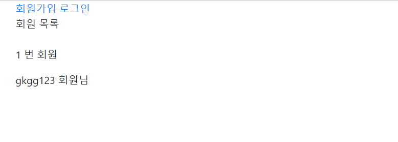
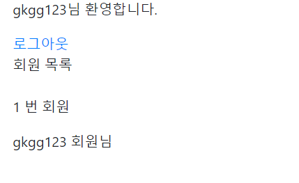
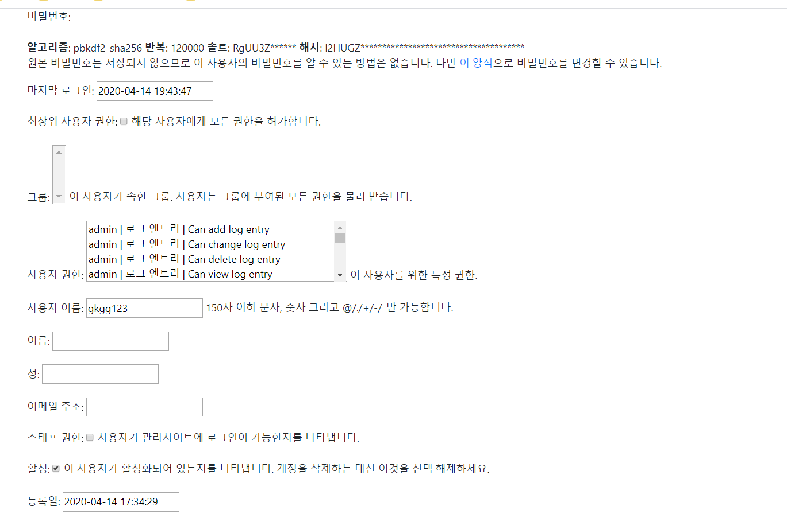
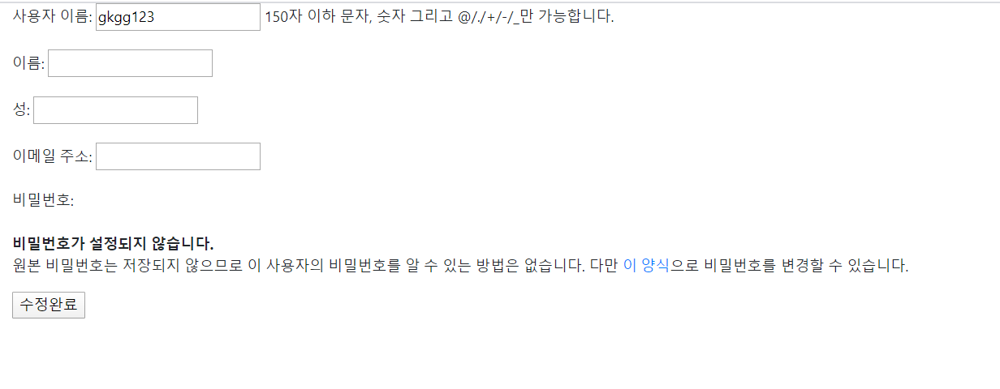
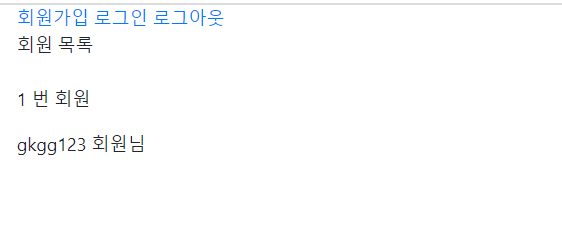
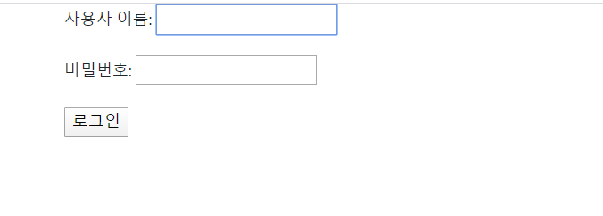
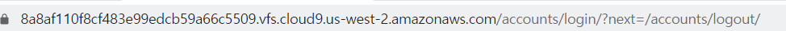

### Accounts앱을 만드는 순서

- 기본적인 `settings.py`, `urls.py`의 설정은 건너 뛰겠다. 
- `accounts`를 만드는것이므로 처음에 `migrate`는 기본적으로 해줘야한다.


## 첫화면 만들기

- accounts/urls.py

```python
from django.urls import path
from . import views

app_name='accounts'
urlpatterns=[
    path('',views.index,name='index')
    ]
```

- accounts/views.py

  ```python
  from django.contrib.auth import get_user_model
  
  def index(request):
      User=get_user_model()
      users=User.objects.all()
      context={
          'users':users
      }
      return render(request,'accounts/index.html',context)
  ```

- accounts/templates/accounts/index.html

  ```html
  
  
  
  
      <div>회원 목록</div>
      <br>
      
          <p>{{ user.id }} 번 회원</p>
          <p>{{user.username }} 회원님 안녕하세요</p>
      
  
  
  ```

- 그냥 먼저 앞에 가장 먼저 첫화면을 그냥 만들어줬다.  `base.html`은 그냥 화면을 예쁘게 꾸미기 위해 설정해준것이지 필수는 아니다.

- 그리고 `get_user_model`은 커스텀한 `User`모델을 쓸수 있으니 이 명령어를 통해 장고에서 쓰는 `User` 모델을 가져올수있게 해주는 `get_user_model`을 쓰는게 좋다.


### 회원가입 만들기

- accounts/urls.py

  ```python
  urlpatterns=[
      path('',views.index,name='index'),
      path('signup/',views.signup,name='signup'),
      ]
  ```

- accounts/views.py

  ```python
  from django.contrib.auth.forms import UserCreationForm
  
  def signup(request):
      if request.method=='POST':
          form=UserCreationForm(request.POST)
          if form.is_valid():
              form.save()
              return redirect('accounts:index')
      else:
          form=UserCreationForm()
      context={
          'form':form
      }
      return render(request,'accounts/signup.html',context)
  ```

- accounts/templates/accounts/signup.html

  ```html
  
  
  
      <form action="" method='POST'>
          
          {{ form.as_p }}
          <button>회원가입</button>
  
  
      </form>
  
  ```

- 기본적인 과정은 CRUD의 Create와 같다 여기서 주의 할점은 Password의 보안성 때문에, UserCreationForm()을 쓸뿐 그 외에는 동일하다.

- 결과화면

  

### 로그인 기능 구현

- accounts/urls.py

  ```python
  path('login/',views.login,name='login'),
  ```

- accounts/views.py

  ```python
  from django.contrib.auth.forms import AuthenticationForm
  from django.contrib.auth import login as auth_login
  def login(request):
      if request.method=='POST':
          form=AuthenticationForm(request,request.POST)
          if form.is_valid():
              auth_login(request,form.get_user())
              return redirect('accounts:index')
      else:
          form=AuthenticationForm()
      context={
          'form':form
      }
      return render(request,'accounts/login.html',context)
  ```

- accounts/templates/accounts/login.html

  ```python
  
  
  
  
  
      <form action="" method='POST'>
          
          {{ form.as_p }}
          <button>로그인</button>
      </form>
  
  ```

- 여기서 주의할 점은, 여기서는 `AuthenticationForm`이라는 특별한 모듈을 쓴다.  이 모듈은 다른 `Form`들과 다르게 `forms.ModelForm`이 아닌 `form.Form`을 상속받기 때문에, 저장을 할때, 2개의 입력값이 필요하다, `request.POST` 라는 사용자가 입력한 값 뿐만 아니라, `request`도 넣어주어야한다.

- 그리고 사용자가 입력한 정보를 `form`에 저장한뒤 이 값의 유효성검사가 끝나면, `django`에 있는 `login`함수를 이용해,  로그인 상태를 세션에 저장시켜줘야한다. 여기서도 2개의 값이 필요한데 첫번째로 `request`와 사용자의 정보인 `form.get_user()`이다. 이렇게 2개를 넣고 `login`함수를 써주면 세션에 로그인 정보가 저장이 된다.

- 여기서 `login`함수를 `auth_login`으로 바꾼이유는 지금 정의한 함수이름이 `login`이여서 겹치는걸 방지하기 위해, 바꿔주었고, 정의한 함수를 `login`으로 한 이유는 `login_required `을 이용하기 위해서이다.

- 결과화면

  

### 로그아웃 기능 구현

- accounts/urls.py

  ```python
      path('logout/',views.logout,name='logout'),
  ```

- accounts/views.py

  ```python
  from django.contrib.auth import logout as auth_logout
  
  def logout(request):
      auth_logout(request)
      return redirect('accounts:index')
  ```

- logout은 단순하게 `django.contrib.auth`에서 `logout` 함수를 불러와서 써주면 된다. 하지만 여기서는 문제점이 발생하는데, `logout`은 `login`이 되어 있는 상황에서만 작동해야한다. 그래서 그 문제점을 해결하기 위해 `login_required`기능을 써야한다.

- accounts/views.py

  ```python
  from django.contrib.auth import logout as auth_logout
  from django.contrib.auth.decorators import login_required
  
  @login_required
  def logout(request):
      auth_logout(request)
      return redirect('accounts:index')
  ```

- `login_requried` 기능은 로그인이 되어야지만 접급이 가능하게 만들어주는 `decorator`이다 추후에 쓸 `next`기능도 탑재되어있다.

- accounts/templates/accounts/index.html

  ```python
  
  
  
  
      
          <p>{{request.user.username}}님 환영합니다.</p>
          <a href="">로그아웃</a>
      
          <a href="">회원가입</a>
          <a href=" ">로그인 </a>
      
  
      <div>회원 목록</div>
      <br>
      
          <p>{{ user.id }} 번 회원</p>
          <p>{{user.username }} 회원님</p>
      
  
  
  ```

- 로그인 되어있는지 아닌지를 확인해서 상황에 따라 다른 문구를 보여주기 위해서, BTL로 구분해줬다.

  `user.is_authenticated`대신 `request.user.is_authenticated`를 쓴 이유는, 전자는 views 함수에서 넘겨준 context의 `user`일수도 있다. 그래서 현재 로그인 되어있는 `user`인지 정확하게 알기위해서 써주었다.

- 결과화면

  
  

- 위와 같이 Login 상태일때와, Logout 상태일때 서로 다른 모습을 보여줄 수 있다.


### 회원정보 수정 기능 구현

- accounts/urls.py

  ```python
  path('update/',views.update,name='update'),
  ```

- accounts/views.py

  ```python
  from django.contrib.auth.forms import UserChangeForm
  
  def update(request):
      if request.method=='POST':
          form=UserChangeForm(request.POST,instance=request.user)
          if form.is_valid():
              form.save()
              return redirect('accounts:index')
      else:
          form=UserChangeForm(instance=request.user)
      context={
          'form':form
      }
      return render(request,'accounts/update.html',context)
  ```

- 위와 같이 만들면 수정하기가 나온다.  우리가 CRUD에서 배운것처럼 폼에 사용자 정보를 넣어주고, 사용자가 입력한 정보를 그대로 받아서 저장해주는 과정은 동일하다. 단지 폼을 `UserChangeForm`을 쓴다는거 외에는 다르지 않다. 그런데 이렇게 쓰지않는다. 

- 결과 화면

  

- 다음과 같이 너무 잡다한 정보들이 너무 같이 출력이 된다. 이러한 것을 해결하기 위해, 사용자가 `UserChangeForm`을 수정해서, 만들어준다.

- accounts/forms.py

  ```python
  from django.contrib.auth.forms import UserChangeForm
  from django.contrib.auth import get_user_model
  
  
  
  class CustomUserChangeForm(UserChangeForm):
      class Meta:
          model=get_user_model()
          fields=['username','first_name','last_name','email']
  ```

- `forms.py`에 다음과 같이 입력해주고, views.py에 `CustomUserChangeForm` 을 `import` 해주고 난뒤에, update함수에서 썼던 `UserChangeForm`을 `CustomUserChangeForm`으로 고쳐주면 된다.

- 우리가 일반적으로 form을 만들때 `from django import forms`로 하고 `class 클래스명(forms.ModelForm)`을 쓰는것과 같이 똑같이 하는것이다. 

- `UserChangeForm`은 우리가 클래스로서 상속받기 위해서 import 해준것이고 우리가 보통 `forms.ModelForm`과 같다. 그리고 `get_user_model()`은 우리가 평소에 모델로 폼을 만들때 모델명을 넣어주는 것처럼 똑같이 하는것이다. `get_user_model()`은 `django`에서 사용되고 있는 `User`모델을 가져오는 것이다. 

- 그리고 난뒤 우리가 `form`에서 보여주고자 하는 `field`를 정해주는 것처럼 `fields`에 적어주면 된다.

- 결과화면

  

- 다음과 같이 `fields`에 적은 항목만 나오는 것을 알 수 있다.


### 탈퇴기능 구현 

- accounts/urls.py

  ```python
  path('delete/',views.delete,name='delete'),
  ```

- accounts/views.py

  ```python
  def delete(request):
      request.user.delete()
      return redirect('accounts:index')
  ```

- accounts/template/accounts/index.html

  ```python
  <a href="{% url 'accounts:delete' ">회원탈퇴</a>
  ```

- 위와 같이 하면 회원탈퇴기능은 완성이 된다. 하지만 여기에는 크게 2가지 문제가 있다.

- 첫번째 문제는 로그인 유무 확인이다. 이 회원탈퇴는 로그인이 되었을때에만 적용되어야한다는 것이다.

- 두번째 문제는 지금과 같이 a태그로 설정시 해당 url를 직접 접속시, 회원탈퇴가 원하지않았는데, 회원탈퇴를 할수가 있다. 그러므로 이 2가지를 보안해줘야한다.

- acconunts/views.py(수정)

  ```python
  from django.contrib.auth.decorators import login_required
  from django.views.decorators.http import require_POST
  
  @require_POST
  @login_required
  def delete(request):
      request.user.delete()
      return redirect('articles:index')
  ```

- accounts/templates/accounts/index.html (수정)

  ```html
  <form action="" method="POST">
      
      <button>회원탈퇴</button>
  </form>
  ```

- `@require_POST`는 위의 버튼을 눌러야지만 POST 방식이 되므로, 원치않는 회원탈퇴를 막아준다.

- `@login_required`는 로그인 상태가 되어야지만 접근이 가능하게 만들어줬다.


### `login_required`를 이용한 추가기능

- `login_required`를 쓰면 `login`상태인지 확인 해주는 기능이 있다고 했다.

- 그런데 이 함수는 추가적인 기능이 있는데,

  
  
- 다음과 같이 추가기능을 보여주기 위해, 원래라면 로그아웃 a태그가 없는데, 비로그인 상태에서 로그아웃이 보이게 해줬다. 이상태에서 로그아웃 태그를 클릭하게 되면  다음과 같이 로그인 나온다.

  

- 다음과 같이 `login_required`가 있으면 강제로 login 화면으로 가게 해주는데 여기서 주의할점은,

- 

- 다음과 같이 url 뒤에 주소가 바뀐다는것이다. 그래서 처음 `login` url을 만들어줄때 `signin`이 아닌 `login`을 만들어준 이유가 `login_requried`기능을 사용하면 `defalut` 값이 `/login/`이 붙여서 이동하게 된다. 그러므로 다른 주소에 `login`기능을 만들게 되면 `login_required`기능을 이용하지 못한다.

- 이것은 설정변경으로 바꿔줄수있지만, 아직 배우지 않았다

- 여기서 더 추가적인 기능은 url 뒷편에 봐보면 알 수있따. `?next=/accounts/logout/` 다음과 같이 뒤에 추가적인 주소인 `next`키를 가진 `GET`형식의 `HTTP`를 보내는것을 알수 있다. 

- 이것은 로그인을 한뒤 원래 로그인을 하지않으면 접근하지못하는 곳으로 다시 이동시켜주기 위함이다. 이것을 활용하기 위해서 `login`함수의 수정이 필요한데, 다음과 같이 수정해주면 된다.

- accounts/views.py

  ```python
  def login(request):
      if request.method=='POST':
          form=AuthenticationForm(request,request.POST)
          if form.is_valid():
              auth_login(request,form.get_user())
              return redirect(request.GET.get('next') or 'accounts:index') ## 바뀐거
      else:
          form=AuthenticationForm()
      context={
          'form':form
      }
      return render(request,'accounts/login.html',context)
  ```

- 위 코드처럼 고치면 되는데, 다른게 바뀐게 아니라, `return`라는 `redirect`만 바뀌었다.

- `redirect(request.GET.get('next') or 'accounts:index')`라 하여, 들어온 주소에서 `next`를 키값으로 가진 값이 있으면, 그 위치로 이동해주고, 아니면 index로 이동해준다. 이게 가능한 이유는

- 파이썬의 단축평가 기능 때문이다. `or`연산자일때 전자가 `TRUE`이면 뒤를 볼 필요없이 전자를 반환해주고, 전자가 `False`이면, 후자를 그냥 반환해주는걸 이용한 방법이다.

  