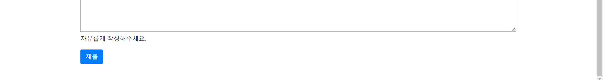

## Django_pjt2

### 구현 과정

#### 1. settings.py 에서 HOST와 template 설정, app 설정을 바꿔주었고, static 설정을 추가해 줬다.

```python
ALLOWED_HOSTS = ['*']
INSTALLED_APPS = [
    'django.contrib.admin',
    'django.contrib.auth',
    'django.contrib.contenttypes',
    'django.contrib.sessions',
    'django.contrib.messages',
    'django.contrib.staticfiles',
    'community',
]
TEMPLATES = [
    {
        'BACKEND': 'django.template.backends.django.DjangoTemplates',
        'DIRS': [os.path.join(BASE_DIR,'templates')],
        'APP_DIRS': True,
        'OPTIONS': {
            'context_processors': [
                'django.template.context_processors.debug',
                'django.template.context_processors.request',
                'django.contrib.auth.context_processors.auth',
                'django.contrib.messages.context_processors.messages',
            ],
        },
    },
]
    
STATICFILES_DIRS = (
    os.path.join(BASE_DIR, "static"),
)
```

#### 2. models.py 에서 이번 플젝에서 쓸 model을 구현해줬다.

```python
from django.db import models

# Create your models here.
class Review(models.Model):
    title=models.CharField(max_length=100)
    movie_title=models.CharField(max_length=30)
    rank=models.IntegerField(default=0)
    content=models.TextField()
    created_at=models.DateTimeField(auto_now_add=True)
    updated_at=models.DateTimeField(auto_now=True)
```

##### 2.1 models.py을 구현한 뒤, 명령어를 쳐서 DB에 적용시켜줬다.

```bash
python manage.py makemigrations
python manage.py migrate
```

#### 3. admin.py에 model의 클래스를 적용해주고, 슈퍼유저를 생성시켰다.

```python
from django.contrib import admin
from .models import Review
# Register your models here.
admin.site.register(Review)
```

#### 4. 완성된 Model의 Form을 만들어 주기위하여 Forms.py 파일을 생성해주고, 기본적인 Form을 완성시켜줬다.

```python
from django import forms
from .models import Review

class ReviewForm(forms.ModelForm):

    class Meta:
        model=Review
        fields='__all__'
```

#### 5. 기본적으로 해당프로젝트에서 쓸 클래스를 생성하고 Form을 완성시켜줬으므로, 그 다음은 url을 설정해주는 작업을했다.

##### 5.1 /djngo_pjt2/urls.py

- include 설정을 적용시켜줬다.

```python
from django.contrib import admin
from django.urls import path,include

urlpatterns = [
    path('admin/', admin.site.urls),
    path('community/',include('community.urls'))
]

```

##### 5.2 /community/urls.py

- app_name과 urlnamespace를 설정해줘서 하드코딩이었던 url을 바꿔주었다.	

```python
from django.urls import path
from . import views

app_name='community'

urlpatterns=[
    path('',views.index,name='index'),
    path('create/',views.create,name='create'),
    path('<int:id>/',views.detail,name='detail'),
    path('<int:id>/update/',views.update,name='update'),
    path('<int:id>/delete/',views.delete,name='delete'),
    ]
```


#### 6. views.py에 url에 해당되는 함수를 설정해줬다.

- 사람마다 차이가 있겠지만 저는 create->index->detail->update->delete 순으로 만들었다.

```python
def create(request):
    if request.method=='POST':
        form=ReviewForm(request.POST)
        if form.is_valid():
            review=form.save()
            return redirect('community:detail',review.id)
    else:
        form=ReviewForm()
    context={
        'form':form,
    }
    return render(request,'community/form.html',context)
```

- create 함수 설명
  - 과거에는 2개의 url을 구분하여 create를 만든 것과 달리 이번에는 한 url을 GET,POST일때를 구분하여, 작업을 시행했습니다.
  - 먼저 해당 url에 최초 접속시에는 GET 방식으로 요청을 하기 때문에 else문으로 들어가게 됩니다. 그리고 우리는 입력폼을 전달해주기 위하여, `form=ReviewForm()`을 하여 그걸 `context`에 넣어 `form.html`로 보내줬습니다.
  - 그렇게 보내진 폼에 사용자가 제출버튼을 누르게 되면 `form.method`가 `POST`이므로, `if`문 안으로 들어가게 되고, `ReviewForm` 을 통해 사용자가 입력한 내용을 `form`에 임시 저장하게 됩니다. 
  - 그렇게 저장된 `form`에서 사용자가 제가 제시한 입력조건들에 대한 유효성 검사를 하게 되고, 통과하게 되면 `save()` 메서드를 통해 DB에 저장하게 만들었고, 작성한 detail 페이지로 돌아가게 `redirect`해줬습니다.
  - 그러나 만약 사용자가 내용을 빠트렸거나 적합하지 않는 입력값을 넣었을때를 대비하여 `context`을 내어쓰기하여, 유효한 값들만 다시 `form`에 담아서 사용자에게 되돌려 주는 작업을 했습니다.

```python
def index(request):
    reviews=Review.objects.order_by('-id')
    context={
        'reviews':reviews,
    }

    return render(request,'community/review_list.html',context)
```

- index 함수 설명
  - `index` 함수에서는 DB에 저장된 모든 값들을 찾아내고, 그걸 반환해주는 작업을 했습니다.
  - `Review.objects.order_by('-id')` 는 DB에 저장된 값들의 각자의 `id`가 높은순으로 정렬을해서 최신의 데이터가 가장 앞으로 오게 해주는 작업입니다.

```python
def detail(request,id):
    review=get_object_or_404(Review,id=id)
    context={
        'review':review,
    }
    return render(request,'community/review_detail.html',context)
```

- detail 함수 설명
  - `detail` 함수는 들어온 `id`값을 가지고 해당되는 DB의 값을 가져온 뒤 반환해주는 작업을 하는 함수입니다.
  - `get_object_or_404` 여기서 이 함수를 써준이유는, 존재하지않는 `id`로 사용자가 접근했을때 404 오류 페이지를 보여주기 위함입니다.

```python
def update(request,id):
    review=get_object_or_404(Review,id=id)
    if request.method=='POST':
        form=ReviewForm(request.POST,instance=review)
        if form.is_valid():
            form.save()
            return redirect('community:detail',id)
    else:
        form=ReviewForm(instance=review)
    context={
        'form':form
    }
    return render(request,'community/form.html',context)
```

- update 함수 설명
  - `update`는 기본적으로 `create`함수와 똑같지만, 입력에 `id`값이 들어오는 것이 살짝 다릅니다.
  - 수정을 할때 이전에 사용자가 쓴 내용을 그대로 불러들여주기 위하여, `get_object_or_404(Review,id=id)`를 통하여, 해당 글에 대한 DB을 호출하였습니다.
  - 그리고 `ReviewForm(instance=review)` 를 통하여 그 값을 form에 넣어주고 반환해줬습니다.
  - 사용자가 수정을 하고, POST 방식으로 제출을하게 되면,`form=ReviewForm(request.POST,instance=review)` 을 통해 수정된 값을 `form`에 저장해줍니다. 단순히 `form=ReviewForm(request.POST)`가 아닌 위와 같이 쓰는 이유는 후자처럼 사용시 장고는 수정된 파일이 아닌 새로운 파일로 인식하여, 새롭게 DB에 저장하기 때문에 전자처럼 `instance`에 수정하고자 하는  Data를 넣어주었습니다.

```python
@require_POST
def delete(request,id):
    review=get_object_or_404(Review,id=id)
    review.delete()
    return redirect('community:index')
```

- delete 함수 설명 
  - 들어온  `id` 값을 통해 해당 DB를 찾아내고 `delete()` 해주었습니다.
  - 여기서 중요한것은 html에서 `POST` 방식으로 `delete`에 접속하도록 하고, 그걸 검증해주는 작업을 해줘야합니다.
  - `delete`함수에 `POST`방식만 접근하게 하지 않았을때에는 사용자가 삭제버튼을 누르지도 않고도, url 접근만으로도 삭제가 가능하기 때문입니다.
  - 그래서 `@require_POST`를 통해, `delete`url에 POST방식으로 접근했을때에만 작동하도록 해줬습니다.

#### 7. views.py의 함수에 대응하는 html 문서를 만들어줬다.

```html
   
        <tr>
          <th scope="row" class="text-center">{{ forloop.revcounter }}</th>
          <td>{{ review.movie_title }}</td>
          <td><a href="" class="text-dark text-decoration-none ">{{ review.title }}</a></td>
          <td>{{ review.created_at }}</td>
        </tr>

    
```

- review_index.html에 대한 설명
  - 코드길이가 길기 때문에 중요한 부분만 말하자면, `views.py`에서 넘어온 `context`를 가지고 `BTL`언어를 이용하여, `for`문을 돌려 하나하나 출력해주었다. 그리고 최신의 것이 가장 위에 올라오게 해주고, 가장 최신의 것이 나중의 번호를 가지게 설정해주기 위하여, `forloop.revcounter`을 써주었다. 이 `BTL`은 반복문이 몇번돌았는지 역순으로 세준다.

```html
<form action="" method="POST">
    
    {{ form.as_p }}
    <input class="btn btn-primary mb-5" type="submit" value="제출">
</form>
```

- form.html에 대한 설명
  - 여기서 중요한것은 `form`의 `method`를 `POST`로 설정해주면 된다는것이다.

```html
    <div class="row justify-content-center border">
        <div class="h4 text-center border-bottom col-8 offset-2 my-5 mx-0 px-0">{{ review.title }}</div>
        <p class="col-12 text-justify py-5 px-5 text-warning" style=" border:solid 1px black;font-size:1rem">
            {{review.content}}
        </p>
        <div class="col-12 h4 text-center">
            평점 : {{ review.rank }}
        </div>

        <div class="offset-4 col-8 text-right mt-5">
           <p> 작성 날짜 : {{ review.created_at}} </p>
        </div>
        <div class="offset-4 col-8 text-right">
           <p> 수정 날짜 : {{ review.updated_at}} </p>
        </div>

    <a class="btn btn-primary mx-5 mb-5" href="" role="button">수정</a>
    <form action="" method="POST">
        
        <input class="btn btn-primary mb-5" type="submit" value="삭제">
```

- review_detail.html에 대한 설명
  - 기본적으로 `views.py`에서 넘어온 `context`에 있는 `review`를 상황에 알맞게 배치하면 된다.
  - 여기서 중요한것은 수정, 삭제 Link이다. 이 중에서도 삭제 링크이다.
  - 삭제링크는 `form`으로 감싸줘야한다. 그 이유는 `delete` URL에 POST 방식으로 접근하는지를 판별해주기 위하여, `form`태그로 감싸고, `method`를 `POST` 방식으로 해주었다.


#### 8. 기본 명세서외 추가적인 스타일링

- bootstrap static 적용

  - `settings.py`에 static 코드를 설정해준 이유는 bootstratp을 설정해주기 위해서 였다.

  - 위와 같이 설정해준 뒤에 bootstrap을 `base.html`에 적용시켜줬다.

    ```html
    
     <link rel="stylesheet" href="">
    
    
     <script src="https://code.jquery.com/jquery-3.4.1.slim.min.js" integrity="sha384-J6qa4849blE2+poT4WnyKhv5vZF5SrPo0iEjwBvKU7imGFAV0wwj1yYfoRSJoZ+n" crossorigin="anonymous"></script>
        <script src="https://cdn.jsdelivr.net/npm/popper.js@1.16.0/dist/umd/popper.min.js" integrity="sha384-Q6E9RHvbIyZFJoft+2mJbHaEWldlvI9IOYy5n3zV9zzTtmI3UksdQRVvoxMfooAo" crossorigin="anonymous"></script>
        <script src="" ></script>
    ```

  - css는`/head` 전에 js는 `/body`전에 위치시켰다, 그리고 `static`을 적용시켜주기 위하여, `` 을 최상위 상단에 적어주었다.

  - 또한 `bootstrap`파일은 최상단 폴더에서 `static`이란 폴더를 생성 후 `bootstrap`이란 하위폴더에 넣어주었다.

- `base.html` 꾸미기

  ```html
      <nav class="navbar navbar-expand-md navbar-dark sticky-top bg-dark">
        <a class="navbar-brand" href="">
          
        </a>
        <button class="navbar-toggler" type="button" data-toggle="collapse" data-target="#navbarsExample04" aria-controls="navbarsExample04" aria-expanded="false" aria-label="Toggle navigation">
        <span class="navbar-toggler-icon"></span>
        </button>
        <div class="collapse navbar-collapse justify-content-end" id="navbarsExample04" style>
          <ul class="navbar-nav list-unstyled mb-0 ">
              
  
              
          </ul>
        </div>
    </nav>
  ```

  - nav 바 부분 
    - 여기서 특징적인 부분은 ``,` `
    - ``는 nav 바에 로고이미지를 static하게 적용시켜 주기 위해서, 만들어줬다. image 파일은 bootstrap과 같이 static 폴더 안에 `image`폴더를 생성후 넣어주었다.
    - 그리고 ``를 설정해준 이유는 나중에 `/community/create/` 와 `/community/` 일때 각자 상황에 맞는 글씨를 `active`하게 해주기 위하여 ``를 설정해줬다.

  ```html
  <div class="container">
      
      
      </div>
  ```

  - body 부분
    - body는 별다른 구조 없이 `block body`를 만들어주고, 그걸 `<div class="container">`로 감싸주었다.
  
- 각 `html` 문서 추가적으로 꾸민부분

  ```html
      
      
          <li class="nav-item mx-3 my-2 active"><a href="" class="nav-link">전체 리뷰 목록</a></li>
          <li class="nav-item mx-3 my-2 "><a href="" class="nav-link">새로운 리뷰 작성하기</a></li>
      
          <li class="nav-item mx-3 my-2 "><a href="" class="nav-link">전체 리뷰 목록</a></li>
          <li class="nav-item mx-3 my-2 "><a href="" class="nav-link">새로운 리뷰 작성하기</a></li>
      
      
  ```

  - `review_list` 의 nav바 부분 
    - `request.resolver_match.url_name`을 통해  맞는 페이지에 들어오면 `active`를 통해 강조해주었다.

  ```html
  <div id="carouselExampleControls" class="carousel slide mt-2" data-ride="carousel">
    <div class="carousel-inner">
      <div class="carousel-item active">
        
      </div>
      <div class="carousel-item">
        
      </div>
      <div class="carousel-item">
        
      </div>
  
      <div class="carousel-item">
        
      </div>
  
  
      <div class="carousel-item">
        
      </div>
    </div>
  
  
    <a class="carousel-control-prev" href="#carouselExampleControls" role="button" data-slide="prev">
      <span class="carousel-control-prev-icon" aria-hidden="true"></span>
      <span class="sr-only">Previous</span>
    </a>
    <a class="carousel-control-next" href="#carouselExampleControls" role="button" data-slide="next">
      <span class="carousel-control-next-icon" aria-hidden="true"></span>
      <span class="sr-only">Next</span>
    </a>
  </div>
  
  
  
  <div class="text-center h1 col-6 offset-3 mt-5 mb-5" style="border-bottom: 2px solid">영화 리뷰 게시판</div>
  
  <table class="table mx-auto table-bordered mt-5">
    <thead class="thead-light">
      <tr>
        <th scope="col" class="text-center">번호</th>
        <th scope="col" class="text-center">영화제목</th>
        <th scope="col" class="text-center">글 제목</th>
        <th scope="col" class="text-center">작성시간</th>
      </tr>
    </thead>
    <tbody>
  
      
          <tr>
            <th scope="row" class="text-center">{{ forloop.revcounter }}</th>
            <td>{{ review.movie_title }}</td>
            <td><a href="" class="text-dark text-decoration-none ">{{ review.title }}</a></td>
            <td>{{ review.created_at }}</td>
          </tr>
  
      
        </tbody>
  </table>
  <nav class="offset-4 mb-5 col-4" aria-label="Page navigation example">
              <ul class="pagination m-0">
                <li class="page-item"><a class="page-link" href="#">Previous</a></li>
                <li class="page-item"><a class="page-link" href="#">1</a></li>
                <li class="page-item"><a class="page-link" href="#">2</a></li>
                <li class="page-item"><a class="page-link" href="#">3</a></li>
                <li class="page-item"><a class="page-link" href="#">Next</a></li>
              </ul>
            </nav>
  
  ```

  - `review_list.html`의 본문 부분
    - 여기는 명세서와 비슷하게 했지만 `carousel`과 `Page navigation`을 꾸며주었고, 제목을 클릭시 해당 글의 상세페이지로 들어가도록 설정해주었다.

  ```html
      
      
          <li class="nav-item mx-3 my-2 "><a href="" class="nav-link">전체 리뷰 목록</a></li>
          <li class="nav-item mx-3 my-2 active "><a href="" class="nav-link">새로운 리뷰 작성하기</a></li>
      
           <li class="nav-item mx-3 my-2 "><a href="" class="nav-link">전체 리뷰 목록</a></li>
          <li class="nav-item mx-3 my-2 "><a href="" class="nav-link">새로운 리뷰 작성하기</a></li>
      
      
  ```

  - `forms.html`의 `nav` 부분
    - 위의 `review_list.html`의 nav와 같이,  `/community/create/`로 접속을 하면 새로운 리뷰작성하기가 강조되도록하였다.

  ```html
      
          <h2 class="text-center font-weight-bold">새 글 작성</h2>
      
          <h2 class="text-center font-weight-bold">수정하기</h2>
      
  ```

  - `forms.html`의 본문부분
    - `form.html`은 기본적은 `/community/create/`와 `/community/update`가 같은 html 문서를 쓰기 때문에 어느 페이지인지 구분해주기 위하여, 위와 같이 설정해주었다.


- `forms.py`를 통해 `form`을 꾸민 부분

  ```python
  class ReviewForm(forms.ModelForm):
      title = forms.CharField(
                  label='제목',
                  help_text='',
                  widget=forms.TextInput(
                          attrs={
                              'class': 'w-100 ',
                              'placeholder': '제목 입력'
                          }
                      )
              )
      content = forms.CharField(
                  label='내용',
                  help_text='자유롭게 작성해주세요.',
                  widget=forms.Textarea(
                          attrs={
                              'class':'w-100',
                          }
                      )
              )
      movie_title = forms.CharField(
                  label='영화제목',
                  widget=forms.TextInput(
                          attrs={
                              'class':'w-100',
                          }
                      )
              )
      rank = forms.CharField(
                  label='별점',
                  widget=forms.NumberInput(
                          attrs={
                              'class':'w-100',
                              'max':'10',
                              'min':'0'}
                      )
              )
      class Meta:
          model=Review
          fields='__all__'
  ```

  - 기본적으로 제공되는 `form`을 고치기 위하여 `widget`이라는 것을 이용하여, 제가 원하는 각자의 `class`를 적용시켜주었다. `rank` 같은 경우 `min` `max`를 통해 최소값과 최대값을 설정해주었다.


### 결과 사진


- `review_list` 화면 




- `/community/create/` 화면


- `community/<int:id>/detail` 화면


- `community/<int:id>/update` 화면


### 해당 프로젝트를 어려웠던 점

#### 1. GET 방식과 POST 방식 미숙으로 인한 한 URL로 작업하는 것이 익숙하지 않았다.

- 기존에는 두개의 URL로 구분하여, 작업을 구분하였다면 이번프로젝트에서는 하나의 url을 이용하지만 , GET과 POST의 차이점을 이용하여, 두개의 작업을 한 URL에서 이루어냈다.
- 하지만, 기존의 작업방식의 다른점 같은 url을 이용한다는점에서 헷갈렸던게 꽤 많았다.


#### 2. bootstrap static 적용

- 기존에는 cdn을 통해서 bootstarp을 적용시켰다면 이번에는 static을 이용하여, bootstrap을 적용시켜보았다.
- 기존에 잘 쓰이지않는 static이고 settings.py에 추가적으로 적용시켜야하는 점 때문에 어려웠다.

#### 3. forms.py를 통한 form customizing 

-  기본적으로 제공된 form을 이용하지 않고 사용자가 원하는 방식으로 고치기 위해서는 `forms.py`에서  `widget`을 이용하여, 고쳐주어야했다. 수업시간에 금방 지나가기도 하였고, 클래스와 labbel등 다양한 조건을 만족시켜주기 위해서, 직접 인터넷을 찾으면서 값을 고치다 보니 어려웠따.

