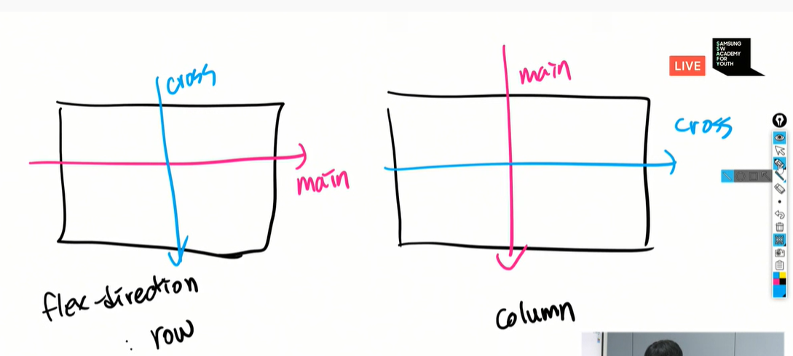
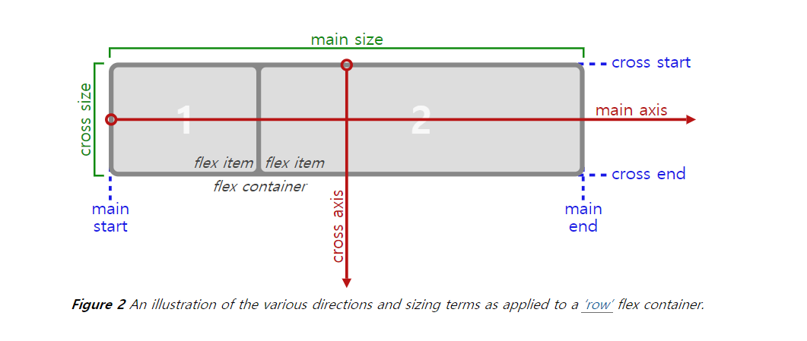

# HTML/CSS 의 배치 핵심

### <hr>Flex 주요 개념</hr>

- `container`,`item`

  ```html
  <style>
      .container{
          display:flex;
      }
  </style>
  
  <div class="container">
      <div class="item"></div>
      <div class="item"></div>
  </div>
  ```

- `main axis`,`cross axis`
- `flex` 정의시
  - `main axis` 기준으로 배치가 된다. (기본은 `row`)
  - 모든 `item`은 행으로 배치된다.(`flex-direction`:`row` 값으로 기본 설정 됨)
  - 모든 `item`은 `cross axis`을 모두 채운다.
  - 모든 `item`은 본인의 너비 혹은 컨텐츠 영역만큼 너비를 가지게된다.(`flex-wrap: nowrap`이 기본값이기 때문이다.)
    - 경우에 따라서, 본인이 지정받은 너비보다 작을 수 있다.







### flex 속성

#### 1. flex-grow

> `flex-grow`는 남은 너비를 나눠 가진다.

#### 2. justify content

> `justify content`은 아이템의 정렬위치를 결정해준다.

- `flex-start ` (기본값)

- `flex-end`

- `center`

- `space arround`

- `space between`

- `space evenly`

#### 3. align items

> `align items`은 cross line의 정렬을 결정해준다.

- `stretch` (기본값)

- center

- baseline(item의 font 사이즈의 줄을 맞혀준다.)

- flex-start (crossline의 처음에 붙여서 나온다.)

- flex-end

#### 4. order

> 아이템의 순서를 정의할 수 있다.

- 기본값 : 0
- 배치를 위한 순서를 정해준다.

#### 5. align-self

> `align-self`은 `align-item`의 기능을 `item`마다 직접 설정 가능하다.