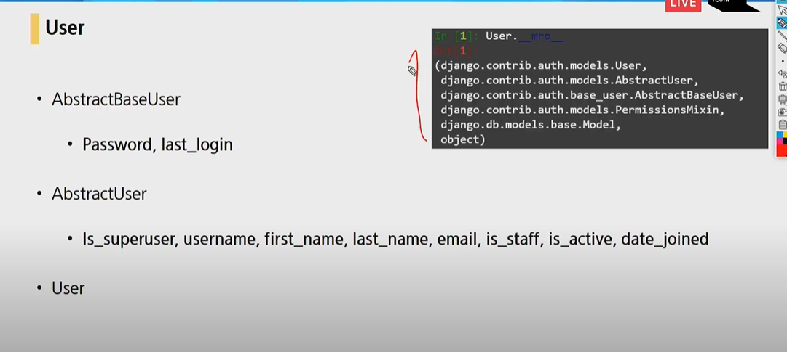
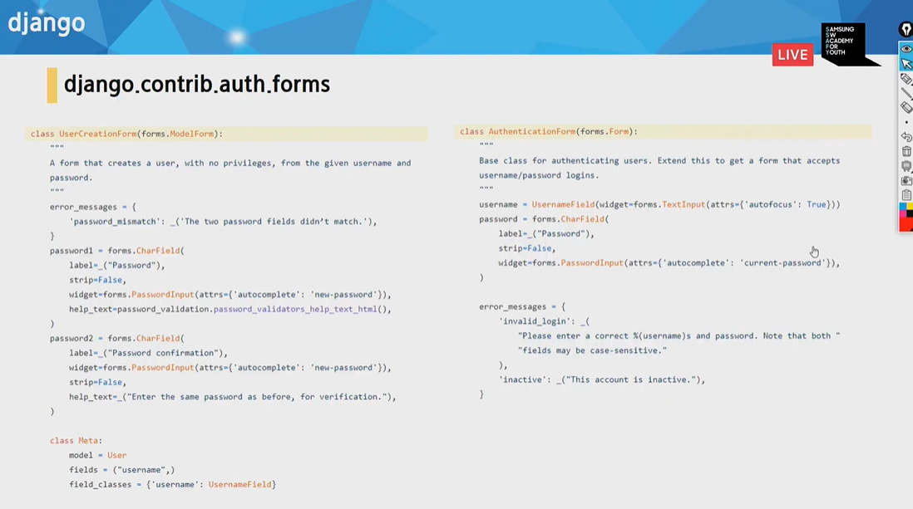

## 정리

### UserCreationForm을 쓰는 이유

Article.object.create() 는 비밀번호를 그대로 저장 

vs

User.objects.create_user(username,email=None,password=None)  암호화

user.set_password(password)  비밀번호를 암호화해준다.

### HTTP에서 로그인 유지 관련

- 기본 적으로 HTTP는 Stateless & Connectless 이므로 쿠키를 사용

### 로그인 관련

- AuthenticationForm 은 ModelForm을 상속받는것이 아닌 그냥 Form을 상속받는다. 그래서 UserCreationForm과 ArticleForm과 달리 Model과 연관이 없다.

- AuthenticationForm 은 AuthenticationForm(request,request.POST)를 하는 이유는 사용자의 요청뿐만 아니라, 이 사람의 쿠키와 세션이 필요하므로 request에 들어있으므로, 거기서 가져온다.

- 그리고 사용자의 비밀번호 일치 검증은 is_valid() 함수가 해준다.

- 그리고 login 함수는 AuthenticationForm에서 받아들인 로그인 정보를 가지고, 세션에 로그인 정보를 생성해준다.

- from django.contrib.auth.forms import AuthenticationForm 에서 가져온다.

- from django.contrib.auth import login

  -`user.is_authenticated`   HTML에서 쓰는 로그인됬는지 확인-- 

  

  - `request.resolver_match.url_name` 은 url_name과 일치 불일치

`from django.contrib.auth.decorators import login_required`

​	`login_required`을 하면 login될때만 작동한다. 쓰는법은 `require_POST`와 같이 @ 붙여서 쓴다.